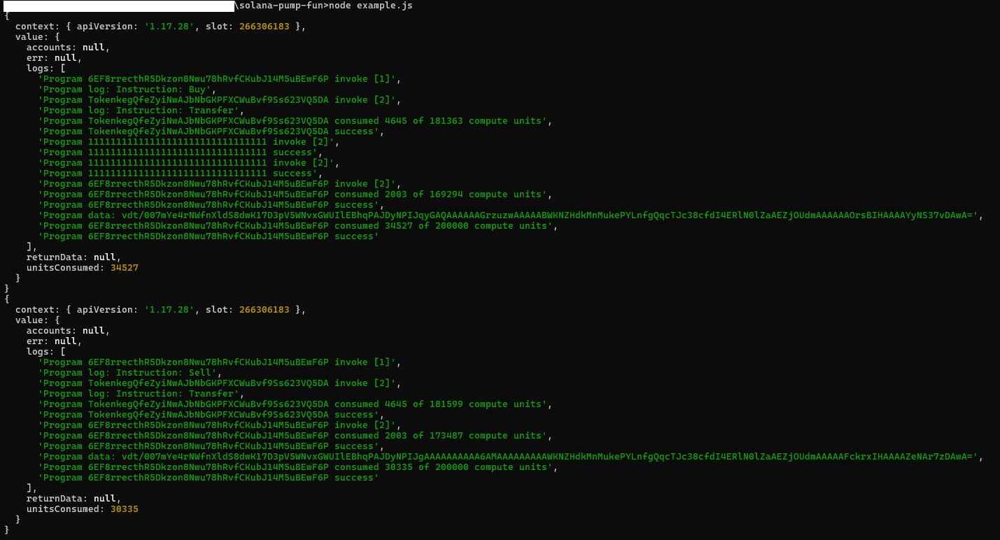

# Solana Pump Fun

Notice: This project was inspired by https://github.com/Allen-Taylor/pump_fun_py and modified for use in typescript with some extra additions.
Also modified the code to send the associated token account creation in a single transaction with the buy or sell for increased speed.

Solana Pump Fun is an open-source package designed to facilitate the execution and simulation of buy and sell transactions for pump.fun on the Solana blockchain. This tool is useful for developers and enthusiasts looking to understand transaction mechanics and resource consumption on Solana.

If you're looking for a launch bundler check out my other repository at: https://github.com/bilix-software/pump-fun-token-launcher

Services are for hire, contact me at https://t.me/bilixsoftware or info@bilix.io
## Features

- Simulates buy and sell transactions for pump.fun on the Solana blockchain.
- Executes buy and sell transactions for pump.fun on the Solana blockchain.
- Provides detailed logs of transaction steps and resource consumption.
- Easy to use and integrate into existing projects.

## Prerequisites

Ensure you have the following installed:

- [Node.js](https://nodejs.org/) (version 14 or later)
- [npm](https://www.npmjs.com/)
- [TypeScript](https://www.typescriptlang.org/)

## Installation

To install the package, clone the repository and install the dependencies:

```bash
git clone https://github.com/bilix-software/solana-pump-fun.git
cd solana-pump-fun
npm install
```

## Configuration

Before running the simulation, you need to set up your private key and specify the token mint. Open the `example.ts` file and replace the placeholder values with your actual private key and token mint address.

### Example Configuration

In `example.ts`, set your private key, token mint address, and transaction mode:

```typescript
const privateKey = 'your_private_key'; // Replace with your actual private key
const mintAddress = 'your_token_mint_address'; // Replace with actual token mint address
const txMode = TransactionMode.Simulation; // Set to Simulation to test, Execution to perform
```

## Usage

To run the example simulation scripts, use Node.js to execute the `example.js` file or compile and run the `example.ts` file. This will simulate buy and sell transactions and output detailed logs.

### Running the Simulation

1. Ensure your `example.ts` file is correctly configured.
2. Compile the TypeScript files:

```bash
npx tsc
```

3. Run the compiled JavaScript file:

```bash
node example.js
```

### Simulate Transactions

If you prefer to run the transactions in simulation mode (without actual transactions on the blockchain), ensure the `txMode` is set to `TransactionMode.Simulation`. This mode will help you understand the transaction process without incurring any cost.

### Example Output

Below is an example of the output generated when running the simulation:



## Project Structure

- `src/`: Contains the source code for the package.
- `example.js`: Example script to demonstrate how to use the package.
- `example.ts`: TypeScript version of the example script.
- `package.json`: Project metadata and dependencies.
- `tsconfig.json`: TypeScript configuration file.

## Contributing

Contributions are welcome! Please fork the repository and submit a pull request with your improvements.

1. Fork the repository
2. Create your feature branch (`git checkout -b feature/YourFeature`)
3. Commit your changes (`git commit -m 'Add some feature'`)
4. Push to the branch (`git push origin feature/YourFeature`)
5. Open a pull request

## License

This project is licensed under the MIT License - see the [LICENSE](LICENSE) file for details.

## Tips
JATt1ta9GcbVMThdL18rXUqHn3toCMjWkHWtxM5WN3ec
